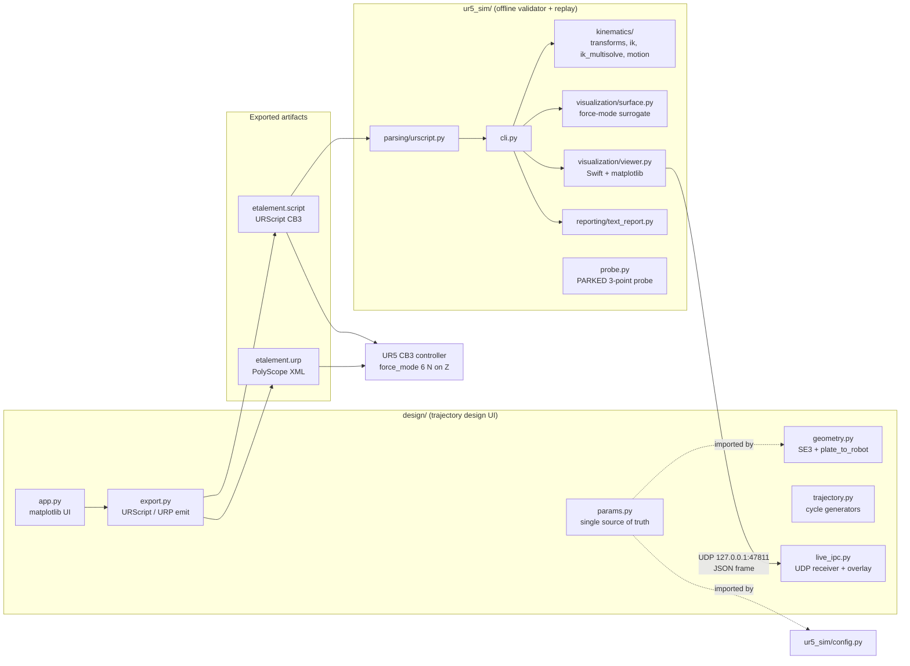

# Architecture — UR5Script

Reference architecture for the ISO/COLIPA cosmetic-spread tooling (UR5 + RobotIQ FT-300 +
2F-85 holding a silicone hemispheric finger). This file is the context base for the next
improvement: it states what exists, which invariants must survive any change, and where
new work plugs in. It supersedes the older module descriptions in `CLAUDE.md` where they
disagree (the design UI is now the `design/` package; IPC is now UDP).

## 1. System overview

Two cooperating Python tools plus the generated on-robot artifacts:



- `design/` is the interactive design UI (entry point kept as `ur5_etalementv6.py`, a
  2-line shim over `design.app.main`). The operator tunes the 6 spreading cycles
  (3 boustrophedon + epicycloid, 3 linear) on a 50x50 mm plate and exports
  `etalement.script` / `etalement.urp`.
- `ur5_sim/` parses the exported URScript, replays it through sequential IK against
  `roboticstoolbox.models.UR5`, applies a kinematic surrogate of the force mode, and
  reports failures (`--check`) or renders the run (`--visualize`, Swift WebGL +
  matplotlib panels).
- The real robot regulates 6 N along Z with `force_mode(...)` during contact strokes;
  the simulator has no physics and emulates this geometrically (section 5).

## 2. Package layout and responsibilities

### `design/` — trajectory design

| Module | Responsibility |
|---|---|
| `params.py` | Single source of truth for every protocol constant (surface, heights, cycle tuning, force targets, probe parameters, TCP speed cap). `ur5_sim/config.py` imports the shared subset from here; never redefine a constant downstream. |
| `geometry.py` | SE(3) primitives and the `plate_to_robot()` / `_abs_pose()` frame conversions. |
| `trajectory.py` | Cycle generators (`circular_cycle`, `linear_cycle`, `triangular_cycle`) in the plate frame (mm). |
| `export.py` | Emits `etalement.script` and `etalement.urp`. Owns the CB3 constraints, the PolyScope memory budget check, and the TCP speed clamp. The program never actuates the 2F-85 (passive finger support: no `rq_*`, no `set_payload`, no tool RS485). |
| `live_ipc.py` | Non-blocking UDP receiver drained on each matplotlib timer tick; converts world-m poses back to plate-mm via the inverse of `plate_to_robot()` and draws the live TCP star + trail on the matching cycle subplot. |
| `app.py` | matplotlib UI, widget wiring, `main()` entry point (`--export`, `--export-urp`, `--no-show`). |

### `ur5_sim/` — validation and replay

| Layer | Responsibility |
|---|---|
| `parsing/urscript.py` | Lenient regex reader. `parse_poses()` returns 4-tuples `(lineno, pose, cycle_idx, in_contact)`; handles three emit formats (`movel(T(p[...]))` legacy, `movel(apply_correction(p[...], dx, dy))` current, plain `movel(p[...])`). `force_mode` / `end_force_mode` toggle `in_contact` inside each `def cycle_N():`. Also parses probe blocks, `NHAT`, the nominal frame, and `global <NAME> = <speed>` preamble declarations. |
| `kinematics/` | `transforms.rotate_translation_y` is the only implementation of the `SIM_TRAJ_ROT_Y_RAD` remap (currently 0.0 since `P_REF` has identity orientation). `ik.run_ik` (sequential IK on link `tool0`), `ik_multisolve` (branch enumeration), `motion.densify_segments`. |
| `visualization/` | `surface.py` (plate geometry + force surrogate), `viewer.py` (Swift scene + matplotlib panels + UDP frame emit), `interactions.py` (widget callbacks), `swift_scene.py`, `mpl_display.py`. |
| `meshes/` | FT-300 + 2F-85 + `Support doigt.stl` pipeline for Swift: decimation, color extraction, link loader. |
| `reporting/text_report.py` | Prints surface events first (`SURFACE_DEVIATION` / `SURFACE_CLAMP`), then IK / joint-limit failures. |
| `cli.py` | Argparse entry (`--check`, `--visualize`, `--identity`); anchors `P_ANCHOR_OLD` / `P_REF`, applies the surface constraint pre-IK, filters expected recontact deviations (section 5), checks TCP speed globals against `URSCRIPT_MAX_TCP_SPEED_MPS`. |
| `config.py` | Paths, anchors, sim DT/speed, surface constants, mesh decimation targets. Shared constants are imported from `design.params`, not duplicated. |
| `ipc_config.py` | UDP host/port/payload constants shared by writer (viewer) and reader (design UI). |
| `probe.py` | 3-point probe simulation. **Parked** (see section 6). |

## 3. Coordinate frames — the invariant chain

Three frames are always in play; every pose and every piece of geometry must travel the
same chain or it lands in the wrong frame.

1. **Plate frame** (mm, +Z out of the plate) - `design/params.py` (`SURFACE_W/H`,
   `Z_CONTACT`, `Z_TRANSIT`, `Z_RETREAT_END`). All trajectory generators work here.
2. **Robot base frame** (m) - `plate_to_robot()` rotates by
   `ROBOT_BASE_ROTATION_DEG = 225` around the plate origin, translates by
   `ROBOT_X_ORIGIN` / `ROBOT_Y_ORIGIN`, and sets `Z = ROBOT_Z_SURFACE` for the contact
   plane.
3. **Absolute world frame** (m) - `_abs_pose()` pre-bakes
   `pose_trans(P_REF, pose_trans(pose_inv(P_ANCHOR_OLD), p_orig))`. The exported script
   carries absolute poses directly (no `T(...)` wrapper). `cli.py` still composes
   `transform(p, P_ANCHOR_OLD, P_REF)` on every parsed pose, then
   `rotate_translation_y(_, SIM_TRAJ_ROT_Y_RAD)`.

Canonical recipe for adding any new geometry (fixture, tool tip, marker):
`plate_to_robot` -> `_abs_pose` -> `transform` -> `rotate_translation_y`, exactly as
`ur5_sim/visualization/surface._plate_corner_world` does.

Tool offset: IK targets `tool0` (rtb flange frame, already including the 82.3 mm wrist
offset); the TCP sits `TCP_TOOL_Z_M` further along tool0 Z, mirrored on-robot by
`set_tcp(...)` so simulator and controller agree.

## 4. URScript generation constraints (CB3 / PolyScope 3.x)

`export.py` targets a CB3 controller. Hard constraints baked into the emitter:

- No `stopl` and no `movel` inside URScript threads.
- No list slicing (`[0:3]`) - CB3 URScript lacks it.
- PolyScope program memory budget checked by `_validate_script_memory()`.
- TCP speed capped at `URSCRIPT_MAX_TCP_SPEED` by `_clamp_tcp_speed()`; the simulator
  re-reads the declared speed globals and flags any excess (real controller would
  safety-stop).
- Contact strokes wrapped in `force_mode(...)` / `end_force_mode()` with
  `FORCE_Z_TARGET` (6 N) along Z.
- Program ends with a pure retreat (`Z_RETREAT_END`, out of force mode) so the operator
  can remove the plate.

## 5. Force-mode kinematic surrogate

No physics layer. `ur5_sim/visualization/surface.apply_surface_constraint` emulates the
6 N regulation, running in `cli.py` **before** `run_ik` so IK receives feasible targets:

- `in_contact = True`: TCP target snapped bidirectionally onto the surface plane;
  pre-snap deviation beyond `CONTACT_SNAP_TOL_M` logged as `SURFACE_DEVIATION` (signed mm).
- `in_contact = False`: clamped from below only; penetration logged as `SURFACE_CLAMP`.
- The recontact descents deliberately target `FORCE_CONTACT_DEPTH` (5 mm) below the
  nominal plane (the real robot stops at contact); `cli.py` filters `SURFACE_DEVIATION`
  events within `SURFACE_FORCE_TARGET_TOL_M` of that depth to avoid one spurious event
  per cycle.
- Toggle: `SURFACE_ENABLE_CLAMP`. `FORCE_Z_TARGET_N` is HUD-label only in sim.

## 6. Surface probing — current state and parked rework

- **Active**: 1-point Z probe (`probe_surface_z`) emitted by `export.py`. Measures the
  plate height only.
- **Parked**: the 3-point probe (`probe_surface_plane`, Rodrigues `MEAS_FRAME`
  reconstruction) proved incorrect - fixed in Z, cannot handle plate rotation or unknown
  plate height. `ur5_sim/probe.py`, its replay in `cli.py` (guarded by
  `SIM_PROBE_ENABLE = False`), and `tests/test_probe_sim.py` are kept inert for a future
  rework, not deleted. Re-enabling means fixing the algorithm first, then flipping the
  flag and un-commenting the tests.

This is the most likely locus of the "next improvement": a correct plane estimation that
handles unknown height and tilt, feeding `apply_correction(p, dx, dy)` (or a full-frame
successor) in the exported script, with a matching geometric replay in `ur5_sim`.

## 7. IPC contract (simulator -> design UI)

UDP unicast on loopback replaces the former `tcp_live/tcp_live.json` atomic-file IPC
(latency ~20-100 us vs 1-10 ms with 50-500 ms tails; drop-tolerant since only the latest
frame matters).

- Constants in `ur5_sim/ipc_config.py`: `127.0.0.1`, port `47811` (override with
  `UR5_SIM_IPC_PORT`), receive buffer 65507 B.
- Writer: `ur5_sim/visualization/viewer.py`, one JSON datagram per frame.
- Reader: `design/live_ipc.py`, non-blocking socket drained per matplotlib timer tick,
  world-m converted back to plate-mm by inverting `plate_to_robot()`.
- Frame keys consumed today: `running`, `cycle`, `frame`, `x_anchor_m` / `y_anchor_m`,
  `trail_anchor_m`. Emitted but not yet consumed: `in_contact`, `force_z_n`,
  `surface_depth_mm` - a ready-made hook for a live force/contact HUD in the design UI.

## 8. Dependency invariants (do not relax)

- `swift-sim==1.1.0` needs `websockets<13`; keep this project's `.venv` isolated from
  the global env (Anthropic/Google SDKs need `websockets>=13`).
- `roboticstoolbox-python==1.1.1` on Python 3.13 + numpy>=2 requires the two in-place
  patches documented in `requirements.txt` (`DistanceTransformPlanner.py` numpy import,
  `xacro/xmlutils.py` `_write_data` signature).
- `swift-sim` on Windows needs the local `/retrieve/<path>` drive-letter patch or the
  UR5 meshes 404 in the browser.
- Tests are stdlib `unittest` only; pytest is not installed in `.venv`.

## 9. Tests and validation workflow

```bash
python -m ur5_sim --check                 # parse + IK, no GUI
python -m ur5_sim --visualize             # Swift 3D + matplotlib
python -m ur5_sim --check --identity      # refactor self-check (identity transform)
python ur5_etalementv6.py --export        # regenerate etalement.script
python -m unittest discover -s tests -p "test_*.py"
```

| Test module | Covers |
|---|---|
| `test_urscript_parse.py` | 4-tuple shape, legacy 3-tuple shim, `force_mode` toggle, `apply_correction` wrapper |
| `test_surface_constraint.py` | `compute_surface_frame`, normal orientation, snap/clamp math, dispatch |
| `test_ik_smoke.py` | first 10 poses end-to-end through IK |
| `test_transforms.py` | SE(3) helpers |
| `test_motion_segments.py` | segment densification |
| `test_limits.py` | joint / speed limits |
| `test_force_target_filter.py` | recontact-depth deviation filtering (section 5) |
| `test_udp_ipc.py` | UDP frame round-trip (section 7) |
| `test_probe_sim.py` | parked with the 3-point probe (section 6) |

No CI: run the suite locally before any change touching parsing, transforms, export, or
the surface module.

## 10. Rules for the next improvement

1. New constants go in `design/params.py`; `ur5_sim/config.py` imports, never redefines.
2. New geometry travels the full frame chain of section 3 - no shortcuts.
3. Anything emitted into `etalement.script` must respect the CB3 constraints of
   section 4 and get a corresponding parser + replay in `ur5_sim` so `--check` stays a
   faithful pre-flight of the real run.
4. Prefer extending the UDP frame (section 7) over reintroducing file IPC.
5. The parked 3-point probe is the designated rework: correct plane estimation
   (height + tilt), then re-enable `SIM_PROBE_ENABLE` and `test_probe_sim.py`.
