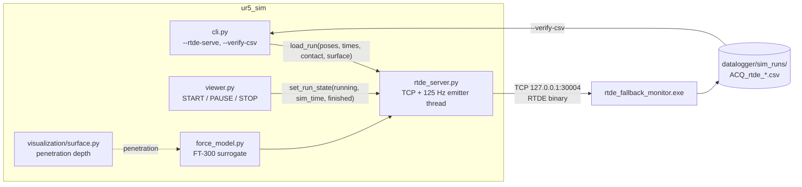

# Spec — RTDE emulator in `ur5_sim`

Design specification for making `ur5_sim` serve a UR5 CB3 Real-Time Data Exchange stream
on loopback, so the already-built `rtde_fallback_monitor.exe` can be exercised end to end
on a development machine with no robot present.

Matching monitor design: [`../plans/plan_rtde_fallback_monitor.md`](../plans/plan_rtde_fallback_monitor.md).
An implementation plan will follow at `../plans/plan_rtde_emulator.md`.

## 1. Purpose

The RTDE fallback monitor is built and unit-tested, but three of its behaviors can only
be verified with the pendant today (that plan's §6 steps 7-9): a new CSV per program run,
a pause that does not split the file, and two runs producing two distinct files. This
spec moves all three to the desk, and adds something neither existing suite can provide:
the Python encoder and the C decoder become two independent implementations of one wire
format, so their agreement is evidence that both are right.

Secondary purpose, requested explicitly: the emulated stream carries a plausible varying
force profile, so a recorded CSV resembles FT-300 data rather than a two-level square
wave, and can be used to exercise downstream analysis.

## 2. What already exists

- `ur5_sim` parses `etalement.script`, replays it through sequential IK, and applies a
  kinematic surface constraint that yields a per-frame penetration depth
  (`ARCHITECTURE.md` §5).
- `ur5_sim/visualization/viewer.py` already assembles a per-frame telemetry dict carrying
  `in_contact`, `force_z_n` and `surface_depth_mm`, and publishes it as JSON over UDP to
  the design UI (`ARCHITECTURE.md` §7).
- `datalogger/rtde_fallback_monitor.exe` connects out over TCP, performs the RTDE
  handshake, and writes one CSV per robot program run.

Three facts established while designing this spec, each of which constrains it:

1. **The UDP channel cannot serve the monitor.** Different transport (UDP against TCP),
   different encoding (JSON against binary big-endian), and the monitor refuses to log
   until a recipe handshake completes. The emulator is therefore a sibling writer, not a
   modification of `live_ipc.py` / `ipc_config.py`, which keep their existing job.
2. **`DT = 0.05` in `ur5_sim/config.py`** — the trajectory's native resolution is 20 Hz,
   below the 50 Hz the monitor targets. Decimation cannot create samples that were never
   sent, so the emulator must interpolate up to the controller rate. A real CB3 does the
   same between waypoints.
3. **The viewer has no pause.** `set_stop()` is a hard stop ("next START must restart from
   frame 0"), and every path zeroes `paused_sim_t`, a variable that is threaded through
   the clock and never used. A real PAUSE is therefore in scope, since without it the
   pause behavior cannot be tested locally at all.

## 3. Architecture

The emulator owns the run. The viewer hands it the trajectory once, then only reports
state; interpolation, force synthesis, encoding and pacing all happen inside the emitter
thread. The 125 Hz stream therefore never inherits matplotlib's timer jitter, and the
server can be driven by a test with no GUI.



### New modules

| File | Responsibility | Depends on |
|---|---|---|
| `ur5_sim/rtde_server.py` | RTDE wire encoder, TCP server, 125 Hz emitter thread, `runtime_state` machine, pose interpolation. | stdlib only. No matplotlib, no Swift, no spatialmath. |
| `ur5_sim/force_model.py` | FT-300 surrogate: contact regulation, stiffness transient, Coulomb friction, sensor noise. Pure and stateful, no I/O. | stdlib only. |

Both stay well under the 4096-token file ceiling of the workspace `code-style.md`.

`rtde_server.py` receives the trajectory already flattened to plain
`(x, y, z, rx, ry, rz)` float tuples. The SE(3) conversion stays in `cli.py` / `viewer.py`,
which already own the frame chain of `ARCHITECTURE.md` §3. This is the boundary that keeps
the server importable and testable on its own.

### Modified files

| File | Change |
|---|---|
| `ur5_sim/config.py` | `RTDE_EMU_*` and `FORCE_MODEL_*` constants. Sim-only, following the existing `SIM_PROBE_*` precedent; they never reach the exported script, so they do **not** belong in `design/params.py`. |
| `ur5_sim/cli.py` | `--rtde-serve` / `--no-rtde-serve`, `--rtde-port`, `--emulate` (headless paced run), `--verify-csv`. |
| `ur5_sim/visualization/viewer.py` | PAUSE control; one `set_run_state(...)` call beside the existing UDP emit; server start/stop around the animation. |
| `datalogger/rtde_fallback_monitor.c` | Loopback provenance warning in the CSV header. |
| `validate.bat` | Start the monitor alongside the visualizer; two new menu entries. |
| `ARCHITECTURE.md`, `README.md`, `CLAUDE.md`, `datalogger/README.md` | Documentation, see §12. |

## 4. Wire contract (shared with the C monitor)

The emulator implements the server side of exactly the recipe the monitor requests:

```
timestamp,actual_TCP_pose,actual_TCP_force,runtime_state
DOUBLE,VECTOR6D,VECTOR6D,UINT32
```

Payload layout, big-endian, 108 bytes, behind the standard 2-byte size + 1-byte type
header:

| Field | Offset | Type |
|---|---|---|
| `timestamp` | 0 | DOUBLE |
| `actual_TCP_pose` | 8 | VECTOR6D |
| `actual_TCP_force` | 56 | VECTOR6D |
| `runtime_state` | 104 | UINT32 |

Protocol version 2 is offered and accepted; version 1 is honored if a client asks for it,
since the monitor falls back to it. Version 2 data packages carry the recipe id byte
ahead of the payload, version 1 does not.

**These constants are duplicated across two languages by necessity.** `test_rtde_server.py`
asserts every offset, the payload size and the recipe string verbatim, so a drift on
either side fails a test instead of producing wrong numbers in a lab CSV.

## 5. Timing, clock and interpolation

- Emitter rate `RTDE_EMU_RATE_HZ = 125`, the CB3 control-loop rate.
- **The stream runs continuously whatever the program state**, as a controller's does:
  packets keep flowing at `STOPPED`, carrying the held last pose and a near-zero force.
  The monitor needs a `STOPPED` packet before `PLAYING` to see the edge that opens a file.
- Translation is linearly interpolated between the 20 Hz trajectory frames. Orientation is
  taken from the nearest frame: the exported trajectory holds orientation constant within a
  cycle, so interpolating it buys nothing and would add a dependency. Documented in the
  module, not assumed silently.
- `timestamp` is monotonic seconds since the server started and **keeps advancing while the
  program is paused or stopped**, exactly as a controller's clock does. A pause therefore
  appears in the CSV as a genuine time gap, which drives the monitor's catch-up path — the
  one that must not emit a burst of back-dated rows on resume. That path currently has a
  unit test against a synthetic stall; this makes it an end-to-end test.
- Velocity for the friction term is differentiated from consecutive interpolated positions
  at the emitter rate.

## 6. `runtime_state` machine

| Viewer event | Emitted sequence |
|---|---|
| Idle, after STOP, after a configuration change | `STOPPED` (1) |
| START | `PLAYING` (2) |
| PAUSE | `PAUSING` (3) for `RTDE_EMU_TRANSITION_PACKETS`, then `PAUSED` (4) |
| RESUME | `RESUMING` (5) for the same window, then `PLAYING` (2) |
| STOP, or end of trajectory | `STOPPING` (0) for the same window, then `STOPPED` (1) |

`RTDE_EMU_TRANSITION_PACKETS = 2` (about 16 ms). Emitting the brief transition states
rather than jumping between the two stable ones is deliberate: it drives the monitor
through the real enum sequence its C suite asserts pair by pair.

Consequence that falls out rather than being special-cased: the configuration radio calls
`set_stop()`, so switching IK branch mid-session closes the current CSV and the next START
opens a new one.

### PAUSE in the viewer

`paused_sim_t` already participates in the clock
(`sim_elapsed = (wall - clock_t0) * SIM_SPEED + paused_sim_t`) and is never set to anything
but zero. PAUSE stores the current `sim_elapsed` into it and clears `running`; RESUME
re-bases `clock_t0` to now and sets `running`. STOP keeps its current hard-stop semantics,
zeroing `paused_sim_t` so the next START replays from frame 0.

## 7. Force model

The signal is derived from the simulator's own geometry, never from a canned waveform:
`surface.py` supplies a per-frame penetration depth that already includes the deliberate
5 mm recontact overshoot of `ARCHITECTURE.md` §5, so the force responds to real trajectory
events.

```
contact:  Fz -> first-order(tau) toward -FORCE_Z_TARGET_N,
               plus a stiffness transient -k * penetration from the depth error
transit:  Fz -> first-order(tau) toward 0
both:     Fx, Fy = -mu * |Fz| * v_hat_xy        (Coulomb friction along TCP travel)
          all three plus Gaussian noise at the FT-300's stated resolution
```

Sign convention follows the monitor plan's own sample row (`ForceZ = -6.012345`): negative
while pressing into the plate.

| Constant | Value | Basis |
|---|---|---|
| `FORCE_MODEL_STIFFNESS_N_PER_M` | 4000.0 | Silicone hemispheric finger; places 6 N at about 1.5 mm penetration |
| `FORCE_MODEL_TAU_S` | 0.05 | `force_mode` regulation rise |
| `FORCE_MODEL_FRICTION_MU` | 0.8 | Silicone on a smooth plate |
| `FORCE_MODEL_NOISE_N` | 0.05 | FT-300 resolution is 0.1 N; sigma chosen for about 0.1 N peak to peak |
| `FORCE_MODEL_SEED` | 20260814 | Fixed, so `--verify-csv` is reproducible |

**These are plausible values, not measurements of this finger and plate.** They are named
and isolated so measured values can replace them later without touching any logic. The
module docstring says so, and so does the emulator's startup banner.

## 8. Provenance and safety

Emulated CSVs land with the same `ACQ_rtde_` prefix and the same header as lab CSVs. For a
research dataset that is a hazard worth designing out:

- The emulator binds `127.0.0.1` only, never `0.0.0.0`. It cannot be reached from the lab
  VLAN and so cannot be mistaken for the robot at `192.168.4.38`.
- The monitor writes `# WARNING: SIMULATED SOURCE - ur5_sim RTDE emulator, not robot data`
  into the header whenever its endpoint is a loopback address.
- Emulator output goes to `datalogger/sim_runs/`, never the repo root.

The emulator sends only RTDE **output** packages. It implements no input path, no register
write and no motion interface, so nothing that speaks to it can be commanded by it.

## 9. CLI surface

| Invocation | Behavior |
|---|---|
| `python -m ur5_sim --visualize` | Serves RTDE on `127.0.0.1:30004` by default. |
| `python -m ur5_sim --visualize --no-rtde-serve` | Visualizer only, no listening socket. |
| `python -m ur5_sim --emulate` | Headless: paces the trajectory in real time and serves RTDE, with no Swift and no matplotlib. Plays once, emits the stop sequence, then exits. |
| `python -m ur5_sim --emulate --runs N` | N consecutive runs separated by `RTDE_EMU_IDLE_S` at `STOPPED`. This is what makes "two runs produce two distinct files" checkable unattended. |
| `python -m ur5_sim --emulate --pause-at T` | Pauses once at simulation time T for `RTDE_EMU_IDLE_S`, then resumes. Makes "a pause does not split the file" checkable unattended, without a human at the button. |
| `python -m ur5_sim --rtde-port N` | Override the port. |
| `python -m ur5_sim --verify-csv [PATH\|auto]` | Check a recorded CSV against the commanded trajectory. |
| `python -m ur5_sim --check` | Unchanged. It has no real-time pacing, so streaming there would compress a three-minute protocol into seconds and produce timestamps that resemble no trial. |

## 10. `--verify-csv`

Comparing CSV row *N* against trajectory time *N* breaks as soon as a pause exists, because
controller time advances while simulation time freezes. The primary check is therefore
geometric and pause-immune.

- **Primary** — distance from each CSV point to the commanded polyline, maximum and RMS.
  The claim is that every recorded point lies on the commanded path. Compared against the
  surface-clamped trajectory, the same array the emulator was handed, not the raw one.
- **Secondary** — row count, effective rate near 50 Hz, `Time` strictly increasing, and
  pause gaps located and reported.
- **Tertiary** — time-aligned pose comparison, run only when no pause gap is found.

Tolerance `1e-5` m. Emitted points are linear interpolations of that same polyline, so the
residual should be formatting noise near `1e-6` m; anything larger is a real frame-chain or
encoding fault. The command exits non-zero on failure so it can gate a scripted run.

## 11. Error handling

The emulator must never take the visualizer down.

| Failure | Behavior |
|---|---|
| Port already in use | Warn, continue without RTDE. The visualizer still runs. |
| No client attached | Accept loop idles; no packet is built. |
| Client disconnects mid-run | Server returns to accepting; the simulation keeps playing. The monitor reconnects on its own 2 s retry. |
| Client slow, `send` would block | Non-blocking send, drop the packet, count it, print the count at stop. A controller drops rather than stalls, and the emitter thread must never stall the render loop. |
| Viewer closed | Daemon thread plus an explicit `stop()` in a `finally`. |

One client at a time. Real RTDE accepts several; this is a deliberate simplification, and
it is documented as one.

## 12. Testing

Python, stdlib `unittest`, no `gcc` and no `.exe` required, so `unittest discover` stays
green on any machine:

| Module | Covers |
|---|---|
| `tests/test_rtde_server.py` | Framing; encoder round-trip against a decoder written in the test; **the field offsets, payload size and recipe string shared with the C monitor**; handshake including the version 1 fallback; the full `runtime_state` sequence including transition states; interpolation midpoints; client disconnect; port-in-use degradation. |
| `tests/test_force_model.py` | Transit force near zero; contact converging to -6 N within a few time constants; friction opposing travel and vanishing at zero velocity; determinism under the fixed seed. |

C side: one new case in `datalogger/tests/test_rtde_fallback_monitor.c` for the loopback
provenance warning.

End to end, outside `unittest` because it needs the built executable: headless emulator,
monitor, then `--verify-csv`, wired as a `validate.bat` entry.

## 13. `validate.bat`

Options 3 and 4 (visualize) gain a `:start_monitor` helper that checks for
`datalogger\rtde_fallback_monitor.exe`, warns and continues if it is absent, and writes to
`datalogger\sim_runs\`. The monitor starts first and retries until the emulator binds. Two
entries are added: an unattended headless emulator plus monitor run, and verification of
the newest CSV.

## 14. Documentation

- `ARCHITECTURE.md`: a new section for the RTDE emulation contract, kept separate from §7,
  which stays about the design-UI overlay; §2, §9 and §10 tables updated. §10 gains a rule:
  the RTDE wire layout is duplicated in two languages and must stay pinned by the offset
  test.
- `datalogger/README.md`: the local test procedure.
- `README.md` and `CLAUDE.md`: the new commands.

## 15. Out of scope

- Any physics engine. The force model is a named surrogate, not a simulation of contact
  mechanics, and the spec says so wherever the numbers appear.
- RTDE input registers, motion interface, or anything that would let a client command the
  emulator.
- Dashboard Server (port 29999) emulation. The monitor rejected it by design; nothing needs
  it.
- The parked 3-point probe (`ARCHITECTURE.md` §6) stays parked.
- Multiple simultaneous RTDE clients.

## 16. Traceability

| Request | Where it is satisfied |
|---|---|
| A true UR5 emulator: running `ur5_sim` submits data over its port | §3, §4, §5, §9 |
| Protocol | §4 |
| File boundaries | §6, plus the PAUSE control |
| Numeric match | §10 |
| Plausible varying force profile resembling FT-300 data | §7 |
| Check the CSV after any simulation | §10, §13 |
| The launcher starts the monitor with `ur5_sim` | §13 |
